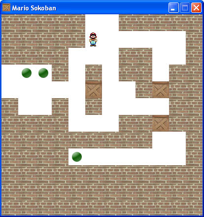

MARIO-SOKOBAN
=============
À propos du Sokoban

« Sokoban » est un terme japonais qui signifie « Magasinier ».
Il s'agit d'un casse-tête inventé dans les années 80 par Hiroyuki Imabayashi. Le jeu a remporté un concours de programmation à cette époque.

Le but du jeu

Il est simple à comprendre : vous dirigez un personnage dans un labyrinthe. Il doit pousser des caisses pour les amener à des endroits précis. Le joueur ne peut pas déplacer deux caisses à la fois.

Si le principe se comprend vite et bien, cela ne veut pas dire pour autant que le jeu est toujours facile. Il est en effet possible de réaliser des casse-têtes vraiment… prise de tête !

La fig. suivante vous donne un aperçu du jeu que nous allons réaliser.

Le cahier des charges
--------------------

Le cahier des charges est un document dans lequel on écrit tout ce que le programme doit savoir faire.
En l'occurence, que veut-on que notre jeu soit capable de faire ? C'est le moment de se décider !

Voici ce que je propose :

* le joueur doit pouvoir se déplacer dans un labyrinthe et pousser des caisses ;
* il ne peut pas pousser deux caisses à la fois ;
* une partie est considérée comme gagnée lorsque toutes les caisses sont sur des objectifs ;
* les niveaux de jeu seront enregistrés dans un fichier (par exemple niveaux.lvl) ;

Le déplacement du personnage suit les régles suivantes :

* Par exemple, on ne peut pas faire monter Mario d'un cran vers le haut s'il se trouve déjà tout en haut de la carte.
* On ne peut pas non plus le faire monter s'il y a un mur au-dessus de lui.
* On ne peut pas le faire monter s'il y a deux caisses au-dessus de lui.
* Par contre, on peut le faire monter s'il y a juste une caisse au-dessus de lui.
* Mais attention, on ne peut pas le faire monter s'il y a une caisse au-dessus de lui et que la caisse se trouve au bord de la carte !